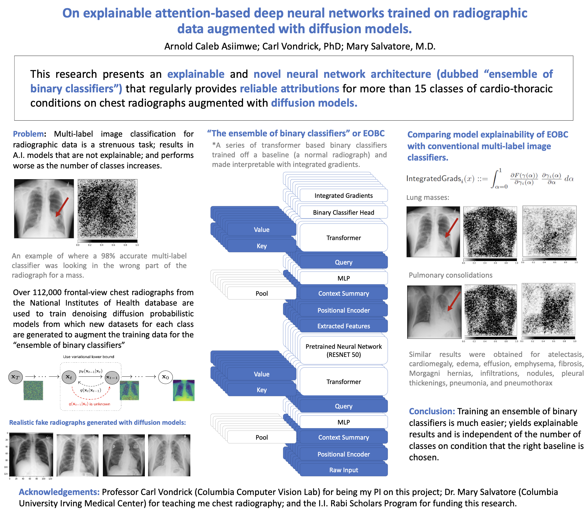

# Adapting Diffusion Models for Augmentation in Medical Imaging Domains

This project is from my freshman year summer at Columbia and it aimed to show that diffusion models, in this case, [Denoising diffusion probabilistic models](https://proceedings.neurips.cc/paper/2020/file/4c5bcfec8584af0d967f1ab10179ca4b-Paper.pdf), can be used in the generation of in radiological scans of normal and diseased individuals in the NIH chest x-ray dataset—and as a result augment the dataset. The results were used to train an ensemble of binary classifiers which were then made intepretable using integrated gradients from the paper, [Axiomatic Attribution of Deep Networks](https://dl.acm.org/doi/10.5555/3305890.3306024).

The dataset used to train the diffusion models is based on that gathered by the NIH and contains over 112,000 anonymized frontal-view chest radiographs from more than 30,000 patients. 

