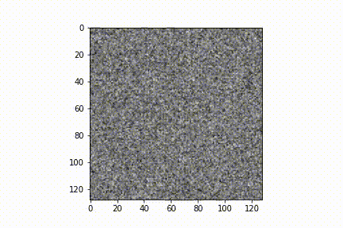

# Adapting Diffusion Models in Medical Imaging Domains

This project aims to show that diffusion models, in this case, denoising diffusion probabilistic models, can be used in the generation of in radiological scans of normal and diseased individuals in the NIH chest x-ray dataset. The dataset used to train the diffusion models is based on that gathered by the NIH and contains over 112,000 anonymized frontal-view chest radiographs from more thatn 30,000 patients. 

